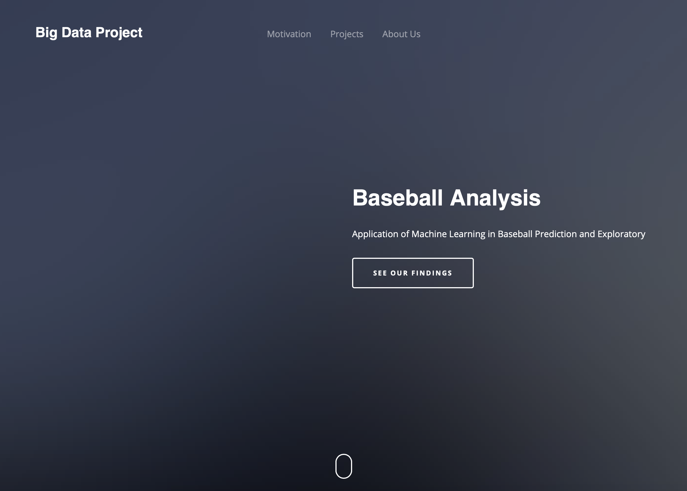
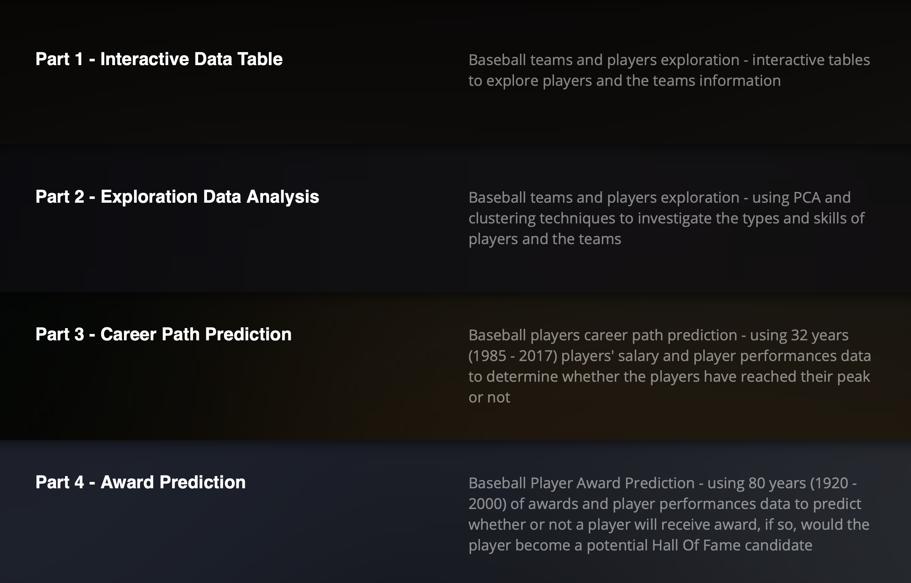
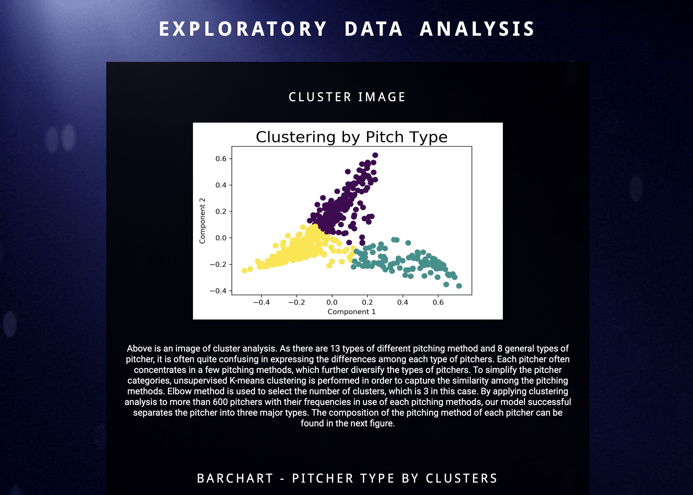
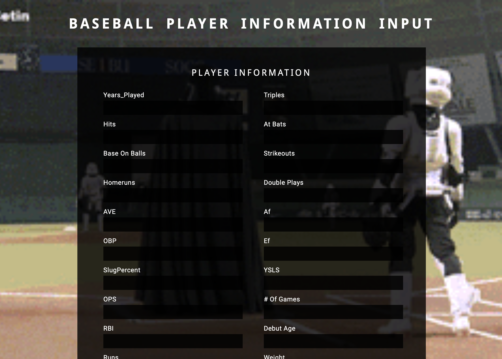

# Baseball Analysis
Term: Fall 2018

+ **Team Members:**
	+ Leo Lam 
	+ Wanting Cui
	+ Yuhan Zha

	
## Introduction:

Machine learning is widely used in baseball prediction. This study aims to construct a classification model for the prediction of award-winning players in order to reveal some potential hidden future baseball stars from a large pool of players. In addition, this study creates a career peak prediction model for the team managers to apply during player selection process in order to predict whether the players have passed their career peak. Furthermore, the study proposes a salary prediction model for the players to evaluate their current contracts on whether they are being underpaid. Lastly, the study performs unsupervised machine learning techniques in categorizing different pitchers. All models result in promising and accurate performances.

## What is the Business Problem Solved:

Baseball is the third most popular sport in the United State with more than 500 million fans globally. The first official baseball game in the United State can be traced back to 1845, and since then, the popularity of baseball has been increasing and remained as one of the most likeable sports in the US. The high popularity of baseball allows the Major League Baseball (MLB) to generate more than $10 billion in the US alone last year with an average MLB player salary at $4.47 million. According to a statistical report, there are more than 15 million professional and amateur baseball players in American in 2017. Besides America, baseball is also extremely fashionable in Japan, Taiwan, U.K., Canada, Cuba, and many other countries. The high global attention of baseball allows MLB to be the highest season attendance of any sports league in the world reaching over 73 million online and television audiences in 2015. As a result, considering the high renown, fever, and income of becoming a professional baseball player, there are many passionate talents trying to join the MLB teams every year, which results in competitive
player selection procedures, especially in the well-known professional teams.

+ **Key Componant:**
	+ Award Winner Prediction
	+ Salary Prediction
	+ Career Peak Prediction
	+ PCA and Clustering in Pitcher Types
	
+ **Our Finding:**
	+ **Award Prediction**
	Multi-Class Random Forest Classification has the highest recall:
	 	+ Recall at 0.9
	+ **Salary Prediction** 	
	XGBoost Regression has the lowest RMSE
	 	+ RMSE at 0.74
	+ **Career Peak Prediction** 
	XGBoost Classification has the highest recall
	 	+ Recall at 0.9


+ **Our Product - Web Application:**
Web App Site: http://35.227.91.177:5000
	+ Home Page
	
	+ Findings
	
	+ Part I - Interactive Table
	
	+ Part II - EDA
	
	+ Part III - Career Peak Prediction
	
	+ Part IV - Award Winner Prediction
	
	+ About Us
	


	


## Data Sources:

Lahmen’s Baseball Database is the primary data source of this study. ​This database contains pitching, hitting, and fielding statistics for Major League Baseball from 1871 through 2017 with 28 datasets. It includes data from the two current leagues (American and National), the four other "major" leagues (American Association, Union Association, Players League, and Federal League), and the National Association of 1871-1875. The major tables that are used in this project are MASTER, Batting, Pitching, Teams,Appearances, AwardsPlayers and Salaries. Master table contains player names, date of birth and biographical information. Batting is the batting statistics with 22 variables and pitching is pitching statistics with 30 variables. Teams contains each team’s yearly statistics and its standing. It also indicates which division and league the team belongs to. Appearances shows ​details on the positions a player appeared at based on year and team. AwardsPlayers records awards won by players and the corresponding year. And salaries contains each player salary data of each year. All the tables can be joined together through playerID or teamID. In addition to Lahmen’s Baseball Database, Statcast is also used in this study. ​Statcast is a state-of-the-art tracking technology that allows for the collection and analysis of a massive amount of baseball data [15]. The data are created through radar and camera systems create Statcast. ​ It provides detail information on each pitch, bat, and defense such as detail statistics on every pitch by pitchers with their opposing pitchers and batters, pitch type, release and perceived velocity, launch angles, spin rate, pitch, and received coordinates. This system was installed in 2015 and it recorded over 2.1 million pitches within 3 years. This information is used in pitcher type clustering and pca analysis. In order to predict salary, ​MLB salaries is used, which obtained from USA TODAY.


## Contribution statement: 

Team members: Leo Lam, Wanting Cui, Yuhan Zha contributed equally in all stages of this project.


	
Following [suggestions](https://github.com/Sapphirine/Baseball_Analysis). This folder is organized as follows.
```
.
├── app                   # Web Application
├── doc                   # EDA and Predictions
├── fig                   # Results figures
├── input                 # Datasets
├── output                # Resutls
```

Please see each subfolder for a README file.

